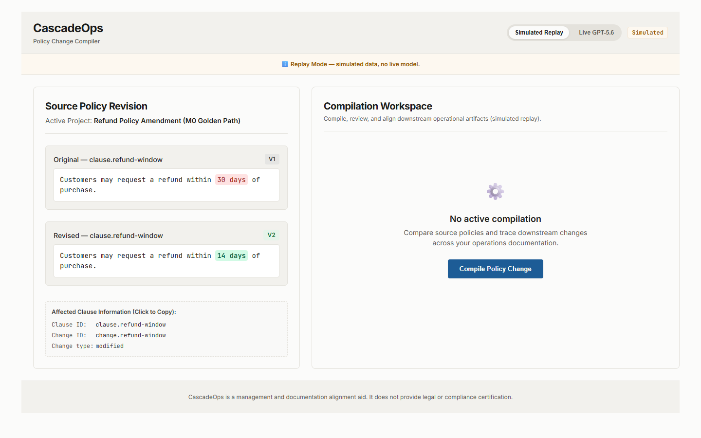
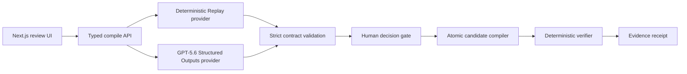

# CascadeOps - Policy Change Compiler

> One policy change. Every operation aligned.

CascadeOps turns an approved policy revision into a traceable, human-reviewed set of candidate updates across dependent operational artifacts. Its focused demo changes one refund-policy window from 30 to 14 days across a support SOP, request form, customer-response template, QA checklist, and training guide.



## Public demo

Try the credential-free deterministic Replay build at [atchayamg.github.io/CascadeOps](https://atchayamg.github.io/CascadeOps/). The public static build deliberately disables Live GPT-5.6; Live Mode remains available in the local/server build with a server-side API key.

## Why it exists

A policy rarely lives in one place. A single approved clause can be repeated across procedures, forms, templates, checklists, and training material. Manual follow-through is slow and easy to audit poorly. CascadeOps demonstrates a safer workflow:

1. Compare the original and revised policy.
2. Trace five source-cited downstream impacts.
3. Propose one bounded patch per exact artifact anchor.
4. Require an explicit human decision on every patch.
5. Compile approved changes into isolated candidate copies atomically.
6. Run deterministic checks for the new value, stale value, anchor integrity, and untouched content.
7. Export a receipt with evidence and an SHA-256 content checksum.

Any rejection or pending decision blocks candidate compilation, verification, export, and receipt generation. A candidate is not called verified until the separate verification action passes.

## Run locally

Requirements: Node.js 22.13 or newer and npm.

```bash
npm ci
cp .env.example .env.local
npm run dev
```

Open `http://localhost:3000`. Simulated Replay is the default and needs no API key.

### Optional live GPT-5.6 mode

Set the server-side environment variable in `.env.local`:

```text
OPENAI_API_KEY=your_key_here
```

Then select **Live GPT-5.6** in the interface. Live mode uses the OpenAI Responses API with Structured Outputs, `store: false`, bounded calls, strict schema validation, and no silent fallback to Replay. The key is never sent to the browser or committed.

## Verification

```bash
npm run lint
npm run typecheck
npm test
npm run demo-assert
npm run build
npm run smoke
```

The current evidence is 24 passing unit/domain/route/demo tests, desktop and mobile Playwright flows with axe accessibility checks, and a separate live GitHub Pages replay-flow verifier. A bounded GPT-5.6 smoke test is documented in [docs/testing/LIVE_GPT_5_6_SMOKE.md](docs/testing/LIVE_GPT_5_6_SMOKE.md); it records only non-secret result metadata.

## Architecture



The model may identify impacts and propose bounded replacement text. Deterministic code owns citation validation, approval enforcement, candidate compilation, verification, and receipt construction.

## How Codex and GPT-5.6 were used

- **Codex** served as principal engineer: it reconciled the blueprint, enforced clean contracts and fail-closed boundaries, coordinated external coding workers, implemented and integrated the app, reproduced tests, and audited submission truthfulness.
- **GPT-5.6** powers the optional live impact and patch proposal stages through Structured Outputs. It does not approve changes, write external systems, or determine verification success.

## Safety and limitations

- Replay uses deterministic simulated fixture data and is visibly labelled.
- Candidate artifacts exist only in memory; P0 does not connect to or modify enterprise systems.
- CascadeOps is a management and documentation-alignment aid, not legal advice or compliance certification.
- The receipt checksum supports content-integrity comparison; it is not a digital signature or cryptographic seal.
- P0 covers one tightly bounded five-artifact scenario, not arbitrary document ingestion.
- Live mode requires a valid server-side OpenAI API key and fails closed on provider, schema, or citation errors.

## Project documentation

- [Master blueprint](docs/blueprint/CASCADEOPS_MASTER_BLUEPRINT_v1.md)
- [Architecture](docs/architecture/SYSTEM_ARCHITECTURE.md)
- [Threat model](docs/security/THREAT_MODEL.md)
- [Test strategy](docs/testing/TEST_STRATEGY.md)
- [Submission evidence plan](docs/submission/SUBMISSION_EVIDENCE_PLAN.md)
- [Build status](docs/project/BUILD_STATUS.json)

MIT licensed. Built for OpenAI Build Week 2026 in the Work & Productivity category.
