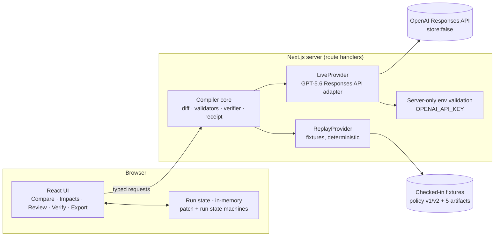

# CascadeOps System Architecture

Derived from `docs/blueprint/CASCADEOPS_MASTER_BLUEPRINT_v1.md` (authoritative). On conflict, the blueprint wins.

## 1. Shape

One dependency-light Next.js (App Router) application, strict TypeScript. No database, no auth, no vector store, no queues, no OAuth, no microservices (ADR-001). All run state is in-memory per browser session; fixtures are checked-in files; the only persistence is user-initiated file download at export.

## 2. Modules

| Module | Responsibility | Boundary rule |
|---|---|---|
| `contracts` | Canonical types + strict schemas for every blueprint §7 object, envelopes, errors | Single definition point; UI, core and providers all import from here |
| `fixtures` | Policy v1/v2, five artifacts, expected Replay impacts/patches, adversarial fixtures | Data only, no logic |
| `compiler core` (server) | Clause diff, payload validation (blueprint §9), state machines (§6), deterministic verifier (§10), receipt builder | Never trusts a provider payload; validates before any state mutation |
| `providers` | `CompilerProvider` implementations: Replay and Live (ADR-003) | Identical interface, identical output schema; Live is server-only |
| `ui` | Five golden-path views + provenance banner/badges + run event log panel | Renders only validated state; no direct provider access; no secrets |

Provider calls run in server route handlers so the Live path (and the API key) never exists client-side. Replay runs through the same route for parity, even though it could run in the browser — one code path, one validation pipeline.

## 3. Golden-path data flow

Exactly blueprint §5. Summary of trust handling per step:

1. Fixture load + clause diff — deterministic core code, no model.
2. `proposeImpacts` / `proposePatches` — the only two model boundaries. Each returns a `ProviderEnvelope`; payload is schema-parsed, then run through the §9 validators (known IDs, citation to a real Clause Change, grounded `beforeText`, no duplicates/conflicts). Any failure aborts the step with a `CO-VAL-*` error; nothing partial is merged.
3. Approval — human-only, per patch (ADR-004). UI offers approve/reject per row; decisions may be re-made (APPROVED ↔ REJECTED) until apply freezes them; no bulk auto-approve exists. The golden path approves all five patches explicitly; rejection is exercised only by the separate alternate-run test (blueprint §5.1).
4. Apply — only after all five targeted patches are approved, the compiler applies them atomically to in-memory candidate copies; originals remain immutable.
5. Verification — deterministic assertions, no model (ADR-005). Failure blocks export.
6. Export — receipt + patched artifacts as downloads. No network write.

## 4. Live provider detail

- OpenAI Responses API, model `gpt-5.6`, Structured Outputs with JSON schemas generated from the same `contracts` schemas, `store: false` on every call.
- Fixed, repo-versioned system prompt; document text passed as fenced untrusted data (blueprint §8 prompt boundary).
- ≤ 2 calls per run, 45 s per-call timeout, typed `CO-PROV-*` failures. On Live failure the run fails visibly; it never silently substitutes Replay output.
- Env validation at server startup: missing key disables Live mode with a clear typed state; Replay is unaffected.

## 5. State ownership

- Patch and run state machines (blueprint §6) are enforced in core, not in UI event handlers — the UI can only request transitions; core rejects illegal ones with `CO-STATE-*`.
- The run event log is an append-only in-memory array owned by core, surfaced read-only to the UI provenance panel.

## 6. Provenance and truthfulness in the UI

- Persistent mode banner: "Replay Mode — simulated data, no live model" or "Live — GPT-5.6 · Responses API · store: false".
- Every model-derived row carries the envelope's `simulated`/`model` values; the receipt embeds them permanently.
- Copy never claims external-system writes, compliance certification, or capabilities beyond the fixture scenario.

## 7. Non-functional targets

Blueprint §14 budgets apply verbatim (replay < 2 s, ≤ 2 live calls, ≤ 32 KB payloads, < 300 KB gz initial bundle, axe ≥ 95). Accessibility: full keyboard operability of the golden path, visible focus, labelled controls, live-region announcements for state changes.

## 8. ADR index

| ADR | Decision |
|---|---|
| ADR-001 | Single Next.js application, dependency-light |
| ADR-002 | Strict policy compilation contract, fail closed |
| ADR-003 | Explicit Replay and Live providers behind one interface |
| ADR-004 | Human-approved patch state machine |
| ADR-005 | Deterministic verification before export |
