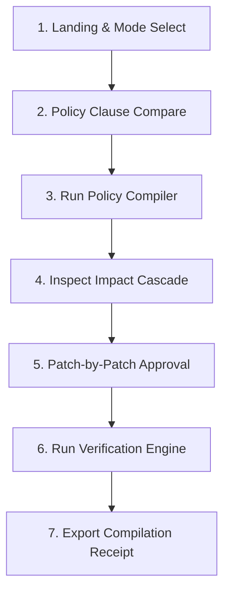

# User Journeys — CascadeOps

This document defines the primary user journey for **Sarah Vance, Operations Change Owner**, focusing on the 90-second judge golden path. It details the interface interactions, expected system feedback, and alternative accessibility paths.

---

## 1. Golden Path: The 90-Second Policy Compilation

### Goal
Sarah must compile, review, approve, and verify the operational transition of the company's refund window from **30 days to 14 days** across five operational documents, then export the compilation receipt.

### Step-by-Step Golden Path

#### Step 1: Landing & Mode Selection
* **Action**: Sarah lands on the CascadeOps console. She verifies that the mode is toggled to **Simulated Replay** (demonstrated via a prominent `"Simulated"` label) and selects the active project workspace: `"Refund Policy Revision (30 to 14 Days)"`.
* **System Feedback**: The system loads the project metadata. The main screen split-view updates to show the Policy Diff Panel on the left and the compilation actions on the right.
* **Duration**: 0–10 seconds.

#### Step 2: Policy Clause Comparison
* **Action**: Sarah inspects the policy comparison panel. She views the old policy text side-by-side with the new policy text, paying special attention to clause `REFUND-01`.
  * *Old (Clause REFUND-01)*: `"Customers may request a full refund within thirty (30) days of purchase."`
  * *New (Clause REFUND-01-REV)*: `"Customers may request a full refund within fourteen (14) days of purchase."`
* **System Feedback**: The diff highlights `thirty (30)` in red strike-through text and `fourteen (14)` in green text.
* **Duration**: 10–25 seconds.

#### Step 3: Run Policy Compiler
* **Action**: Sarah clicks the primary action button: `"Compile Policy Change"`.
* **System Feedback**: A calm, restrained spinner appears with a status message: `"Analyzing dependent operational corpus..."` followed by `"Compiling proposed patches..."`. This loading screen resolves within 1.5 seconds.
* **Duration**: 25–30 seconds.

#### Step 4: Inspect Impact Cascade
* **Action**: Sarah reviews the newly generated **Impact Cascade**. She views the list of 5 affected operational artifacts. 
  * *Artifacts Revealed*:
    1. `docs/operations/sop.md` (Support SOP)
    2. `docs/templates/refund_form.json` (Refund Request Form)
    3. `docs/macros/customer_decline_response.txt` (Customer-Response Template)
    4. `docs/qa/checklist.md` (QA Checklist)
    5. `docs/training/onboarding_guide.md` (Training Guide)
* **System Feedback**: The system shows a visual network overview, accompanied by a clean, WCAG-compliant table/list view showing the artifact name, target location, and a status tag: `PENDING REVIEW (Amber)`.
* **Duration**: 30–45 seconds.

#### Step 5: Patch-by-Patch Code Review & Human Approval Gate
* **Action**: Sarah clicks on each of the 5 proposed patches to inspect them. She verifies that each patch card clearly lists the source clause (`REFUND-01`) and the exact target location (e.g., `sop.md#L45`). She clicks `"Approve"` on all 5 patches.
  * *SOP Patch*: Change "...within the 30-day window..." to "...within the 14-day window...".
  * *Form Patch*: Change "Refunds must be requested within 30 days..." to "...within 14 days...".
  * *Response Macro Patch*: Change "...outside our 30-day refund window..." to "...outside our 14-day refund window...".
  * *QA Checklist Patch*: Change "...date is ≤ 30 days..." to "...date is ≤ 14 days...".
  * *Training Guide Patch*: Change "...maintain a 30-day refund window..." to "...maintain a 14-day refund window...".
* **System Feedback**: As Sarah clicks `"Approve"`, the amber status tag on each patch card transitions to a neutral, dark gray checked tag: `APPROVED`. The global state indicator updates to: `"All patches reviewed. Verification required."`
* **Duration**: 45–70 seconds.

#### Step 6: Operations Verification Check
* **Action**: Sarah clicks the primary action: `"Run Verification Check"`.
* **System Feedback**: The verification engine executes a deterministic dry run in memory. It scans the candidate text files to verify that all occurrences of the old refund window are corrected and that no 30-day references remain.
  * Within 1 second, the global state transitions to a bold green banner: `VERIFIED: ALL OPERATIONS ALIGNED`.
  * Individual patch status tags change to `VERIFIED (Green)`.
* **Duration**: 70–80 seconds.

#### Step 7: View & Export Compilation Receipt
* **Action**: Sarah clicks `"Export Compilation Receipt"`.
* **System Feedback**: A modal panel displays the deterministic receipt summary:
  * *Title*: `Compilation Receipt`
  * *Status*: `VERIFIED`
  * *Timestamp*: `2026-07-18T22:37:00Z`
  * *Integrity*: A SHA-256 content checksum computed from the canonical receipt JSON and explicitly labelled as not a digital signature.
  * *Action*: A button to `"Download JSON Receipt"` and a confirmation message: `"Candidate artifacts verified against the 14-day policy fixture."`
* **Duration**: 80–90 seconds.

---

## 2. Alternative Journeys and Safety Off-Ramps

### Journey A: Patch Rejection (Resolution of Discrepancies)
1. Sarah inspects the *Training Guide Patch* and decides the wording needs to be rewritten manually because the patch changes a header.
2. Sarah clicks `"Reject"` on the Training Guide Patch card.
3. **System Feedback**: The card status transitions to `REJECTED (Amber/Red)`. The global banner informs the user: `"Compilation Blocked: One or more patches rejected."`
4. Sarah attempts to click `"Run Verification Check"`.
5. **System Feedback**: The button is disabled (or if clicked, fails immediately), displaying an inline warning: `"Verification cannot run while rejected patches exist."`
6. **Recovery**: Sarah changes the decision to `"Approve"` once she is satisfied, unlocking the compiler.

### Journey B: Screen Reader Access (High Contrast / Linear Flow)
1. A blind operations reviewer accesses CascadeOps using a screen reader (NVDA or VoiceOver).
2. The user navigates via keyboard `Tab` to the **Impact Cascade** section.
3. Instead of parsing a complex spatial canvas, the screen reader reads a semantic HTML table: *"Table: Impact Cascade. 5 rows, 3 columns. Column 1: Artifact, Column 2: Target Location, Column 3: Review Status."*
4. The user navigates through rows: *"Row 2: Support SOP, Section 3.2, Status: Pending Review."*
5. The user hits `Enter` on a patch row to open the details drawer, tabs to the `"Approve"` button, and presses `Space` to confirm.

### Journey C: Live GPT-5.6 Execution Error (Graceful Degradation)
1. Sarah toggles the mode switch to **Live GPT-5.6** and clicks `"Compile Policy Change"`.
2. The server-side API call encounters a network failure or rate limit.
3. **System Feedback**: The spinner stops. An inline, high-contrast alert box (Red boundary) appears:
   * *Heading*: `API Connection Error (Code: CL-429)`
   * *Body*: `"The compiler was unable to establish a secure connection to the GPT-5.6 Responses engine. Please check your network environment or fall back to Simulated Replay mode."`
   * *Traceability*: The session remains safe; no partial or broken patches are forced into the workspace.
