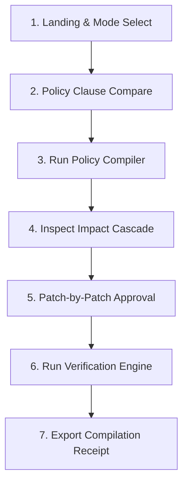

# User Journeys — CascadeOps

This document defines the primary user journey for **Sarah Vance, Operations Change Owner**, focusing on the concise judge golden path. It details the interface interactions, expected system feedback, and alternative accessibility paths.

---

## 1. Golden Path: The 90-Second Policy Compilation

### Goal
Sarah must compile, review, approve, and verify the operational transition of the company's refund window from **30 days to 14 days** across five operational documents, then export the compilation receipt.

### Step-by-Step Golden Path

#### Step 1: Landing & Mode Selection
* **Action**: Sarah lands on the CascadeOps console. She verifies that the mode is toggled to **Simulated Replay** (demonstrated via a prominent `"Simulated"` label) and selects the active project workspace: `"Refund Policy Revision (30 to 14 Days)"`.
* **System Feedback**: The system loads the project metadata. The main screen split-view updates to show the Policy Diff Panel on the left and the compilation actions on the right.
* **Duration**: 0–10 seconds.

#### Step 2: Policy Clause Comparison
* **Action**: Sarah inspects the policy comparison panel and the single modified clause, `clause.refund-window`.
  * *v1*: `"Customers may request a refund within 30 days of purchase."`
  * *v2*: `"Customers may request a refund within 14 days of purchase."`
* **System Feedback**: The diff highlights `30 days` as removed and `14 days` as added.
* **Duration**: 10–25 seconds.

#### Step 3: Run Policy Compiler
* **Action**: Sarah clicks the primary action button: `"Compile Policy Change"`.
* **System Feedback**: A calm, restrained spinner appears with a status message: `"Analyzing dependent operational corpus..."` followed by `"Compiling proposed patches..."`. This loading screen resolves within 1.5 seconds.
* **Duration**: 25–30 seconds.

#### Step 4: Inspect Impact Cascade
* **Action**: Sarah reviews the newly generated **Impact Cascade**. She views the list of 5 affected operational artifacts. 
  * *Artifacts Revealed*:
    1. `docs/operations/sop.md` (Support SOP)
    2. `docs/templates/refund_form.json` (Refund Request Form)
    3. `docs/macros/customer_decline_response.txt` (Customer-Response Template)
    4. `docs/qa/checklist.md` (QA Checklist)
    5. `docs/training/onboarding_guide.md` (Training Guide)
* **System Feedback**: The system shows a clean, WCAG-compliant list showing artifact name, exact target anchor, and `PROPOSED (Amber)` status.
* **Duration**: 30–45 seconds.

#### Step 5: Patch-by-Patch Code Review & Human Approval Gate
* **Action**: Sarah inspects each of the 5 proposed patches. She verifies `change.refund-window`, `clause.refund-window`, and the exact target anchor (for example, `sop.step-2.eligibility`), then approves all 5 individually.
  * *SOP Patch*: `purchase was made within the last 30 days` → `...14 days`.
  * *Form Patch*: `Purchases older than 30 days are not eligible` → `...14 days...`.
  * *Response Template Patch*: `within 30 days of your purchase` → `within 14 days...`.
  * *QA Checklist Patch*: `confirmed purchase within 30 days` → `...14 days`.
  * *Training Guide Patch*: `our 30-day refund window` → `our 14-day refund window`.
* **System Feedback**: Each approved patch transitions from `PROPOSED` to `APPROVED`. The global state becomes `All five patches approved. Candidate compilation available.`

#### Step 6: Compile Approved Candidates
* **Action**: Sarah clicks `"Compile Approved Candidates"`.
* **System Feedback**: All five grounded patches apply atomically to isolated in-memory candidate copies; originals remain unchanged.

#### Step 7: Deterministic Verification
* **Action**: Sarah clicks `"Run Verification Check"`.
* **System Feedback**: The verifier checks the five exact target anchors, candidate values, anchor integrity, untouched blocks, and receipt counts.
  * The global state transitions to `VERIFIED: ALL CANDIDATE ASSERTIONS PASSED`.
  * Individual patch status tags change to `VERIFIED (Green)`.

#### Step 8: View & Export Compilation Receipt
* **Action**: Sarah clicks `"Export Compilation Receipt"`.
* **System Feedback**: A modal panel displays the deterministic receipt summary:
  * *Title*: `Compilation Receipt`
  * *Status*: `VERIFIED`
  * *Timestamp*: Generated at run time in ISO 8601 format.
  * *Integrity*: A SHA-256 content checksum computed from the canonical receipt JSON and explicitly labelled as not a digital signature.
  * *Action*: A button to `"Download JSON Receipt"` and a confirmation message: `"Candidate artifacts verified against the 14-day policy fixture."`

---

## 2. Alternative Journeys and Safety Off-Ramps

### Journey A: Patch Rejection (Resolution of Discrepancies)
1. Sarah inspects the *Training Guide Patch* and decides the wording needs to be rewritten manually because the patch changes a header.
2. Sarah clicks `"Reject"` on the Training Guide Patch card.
3. **System Feedback**: The card status transitions to `REJECTED (Amber/Red)`. The global banner informs the user: `"Compilation Blocked: One or more patches rejected."`
4. Sarah attempts to click `"Compile Approved Candidates"`.
5. **System Feedback**: The action is disabled (or fails closed with `CO-STATE-002`), with no candidate changes and no receipt.
6. **Recovery**: Sarah changes the decision to `"Approve"` once she is satisfied, unlocking the compiler.

### Journey B: Screen Reader Access (High Contrast / Linear Flow)
1. A blind operations reviewer accesses CascadeOps using a screen reader (NVDA or VoiceOver).
2. The user navigates via keyboard `Tab` to the **Impact Cascade** section.
3. Instead of parsing a complex spatial canvas, the screen reader reads a semantic HTML table: *"Table: Impact Cascade. 5 rows, 3 columns. Column 1: Artifact, Column 2: Target Location, Column 3: Review Status."*
4. The user navigates through rows: *"Support SOP, sop.step-2.eligibility, status Proposed."*
5. The user hits `Enter` on a patch row to open the details drawer, tabs to the `"Approve"` button, and presses `Space` to confirm.

### Journey C: Live GPT-5.6 Execution Error (Graceful Degradation)
1. Sarah toggles the mode switch to **Live GPT-5.6** and clicks `"Compile Policy Change"`.
2. The server-side API call encounters a network failure or rate limit.
3. **System Feedback**: The spinner stops. An inline, high-contrast alert box (Red boundary) appears:
   * *Heading*: `Live provider unavailable (CO-PROV-001)`
   * *Body*: `"The compiler was unable to establish a secure connection to the GPT-5.6 Responses engine. Please check your network environment or fall back to Simulated Replay mode."`
   * *Traceability*: The session remains safe; no partial or broken patches are forced into the workspace.
