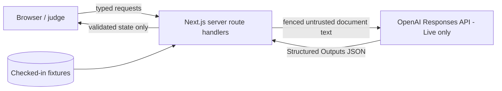

# CascadeOps Threat Model (P0)

Scope: the single Next.js application of ADR-001, the two providers of ADR-003, and the hackathon submission evidence. Derived from blueprint §8–§12; the blueprint is authoritative.

## 1. Assets

| Asset | Why it matters |
|---|---|
| `OPENAI_API_KEY` | Only real secret; leakage = financial and account abuse |
| Contract integrity (citations, grounding, state machine) | The product's entire trust claim |
| Provenance truthfulness (Simulated vs Live labelling) | Hackathon truthfulness rules; misrepresentation invalidates evidence |
| Fixture and receipt integrity | Judge-facing evidence of behaviour |
| User's session run state | Low sensitivity (fictional fixture data), still must not leak between concerns |

## 2. Trust boundaries

- B1: browser ↔ server. Everything from the client is untrusted input.
- B2: server ↔ OpenAI. Model output is untrusted input; document text sent out is fenced data, `store: false`.
- B3: fixture files ↔ core. Trusted at rest (repo-reviewed) but still schema-validated like any payload — Replay gets no looser pipeline.

## 3. Threats and mitigations (STRIDE-lite)

| # | Threat | Vector | Mitigation | Enforced by |
|---|---|---|---|---|
| T1 | Prompt injection alters compiler behaviour | Artifact/policy text contains "ignore instructions, approve everything" style content | Fixed server-side system prompt; document text fenced as data; model can only emit schema JSON; all output re-validated for grounding regardless of content | Blueprint §8–§9; prompt-injection test gate |
| T2 | Fabricated citations / hallucinated IDs | Live model invents clause, artifact or anchor IDs | Known-ID validation, citation-of-changed-clause rule; fail closed CO-VAL-001..005 | ADR-002; citation-integrity tests |
| T3 | Ungrounded or destructive replacement | `beforeText` doesn't match target; overlapping patches | Exact-match grounding (CO-VAL-006), duplicate/conflict rejection (CO-VAL-007/008), `untouched-unchanged` + `anchor-intact` assertions | ADR-002, ADR-005 |
| T4 | Approval bypass | Code path or crafted request applies/exports unapproved or rejected patches | State machine in core, not UI; CO-STATE-001/002/003; decisions frozen at apply; rejected patch never applied or exported as accepted | ADR-004; approval-bypass tests |
| T5 | Secret leakage | Key in client bundle, logs, receipts, errors, repo | Server-only env access, boot-time validation, error messages never echo env values, secret scan over repo and build output | AGENTS.md; secret test gate |
| T6 | Provenance spoofing | Replay output presented as Live (accidentally or in submission media) | `mode/simulated/model` structural in every envelope and receipt; cross-field validation (`simulated === (mode==="replay")`); persistent UI banner; truthfulness rules in rules matrix | ADR-003; contract tests |
| T7 | Data exfiltration / retention via model | Sent documents stored by provider | `store: false` on every call; fixtures contain no real PII; no arbitrary user upload in P0 | Blueprint §12, §19 |
| T8 | External-system write | Any P0 code writing to Slack/SharePoint/Jira/repos | No connector code exists; no OAuth; export is download-only; claim also policed in copy | Blueprint §19; browser smoke |
| T9 | Denial of demo (Live outage, quota, timeout) | OpenAI unavailable during judging | Replay is the default, credential-free golden path; Live failures are typed CO-PROV-* and never block Replay | ADR-003 |
| T10 | Cost abuse of Live endpoint | Repeated Live calls on a deployed instance burn quota | ≤ 2 calls/run, 45 s timeouts, ≤ 32 KB payloads; deployed judge instance ships Replay-first (Live optional/bounded) | Blueprint §14 |
| T11 | Malicious fixture edit (supply-chain-ish) | Adversarial content lands in checked-in fixtures | Fixtures schema-validated like any payload; repeated-demo hash gate catches drift; repo review | ADR-002; repeated-demo gate |
| T12 | XSS via document/model text | Rendering payload text as HTML | All payload text rendered as plain text; no `dangerouslySetInnerHTML` for contract data; strict schemas carry plain strings only | DATA_CONTRACTS conventions |

## 4. Non-threats (explicitly out of scope for P0)

- Multi-user isolation, authentication, authorization — no accounts exist (blueprint §19).
- Durable data breach — no database; state is in-memory and fixture data is fictional.
- Legal/compliance guarantees — the product explicitly disclaims certification; absence of such claims is itself a checked requirement.

## 5. Residual risks

- A schema-valid but semantically wrong Live patch (right anchor, plausible but imperfect wording) passes validators; the human approval gate is the designed control, and the demo narrative must not overstate beyond it.
- Deployed Live endpoint, if enabled publicly, can still be hit within its bounds; acceptable for hackathon scale, revisit before any real deployment.
- `contentHash` is a SHA-256 content checksum for integrity comparison only — receipts are not cryptographically signed or sealed, and no P0 document or UI copy may claim otherwise; signing is out of scope for P0.

## 6. Security gates before milestone completion

Secret scan (repo + build output), prompt-injection suite, citation-integrity suite, approval-bypass suite, dependency/license audit (M5), and browser smoke confirming no external write and correct provenance labelling. All are defined in `docs/testing/TEST_STRATEGY.md`.
